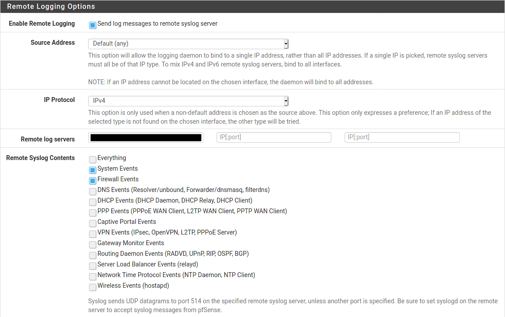

# Graylog_Extractors_pfSense

## Overview
Graylog extractors for the following pfSense services:
* Firewall (I do not have IPv6 extractors)
* Suricata

## Explanation (pfSense firewall logs)
In pfSense versions up to 2.5.0, pfSense used logs in the RFC 3164 format. The format of the actual log message is [broken down as follows](https://docs.netgate.com/pfsense/en/latest/monitoring/logs/raw-filter-format.html):
```<Timestamp> <Hostname> filterlog: <CSV data>```
Note - Hostname is not included in syslog data sent to remote log hosts

The CSV data consists of the following:
* Common fields (this is in all messages)
* Then IPv4 or IPv6 specific data
* Then IP data
* Then protocol-specific data (e.g., TCP, UDP, or ICMP)

This leaves a total of 13 combinations (below). For my purposes, I'm only using IPv4 and the ICMP responses.
* IPv4 TCP
* IPv4 UDP
* ~~IPv6 TCP~~
* ~~IPv6 UDP~~
* Nine different responses for ICMP
  * ICMP Echo
  * ICMP Unreachable protocol
  * ICMP Unreachable port
  * ICMP Uncreachable other
  * ICMP Need Frag
  * ICMP TStamp
  * ICMP TStamp Reply
  * ICMP Default
  * ~~ICMP IPv6~~

## Explanation (pfSense Suricata logs)


## pfSense configuration
Go to *Status*, then *System Logs*, then *Settings*, and scroll down to *Remote Logging Options*.

Enable *Send log messages to remote syslog server*, input the Graylog server name and port in the box (you can send logs to up to three remote log servers), then select *System Events* and *Firewall Events*.


You may also want to change some options under *General Logging Options*. For example, I make sure to enable *Log packets matched from the default block rules in the ruleset* so that I can see things blocked from coming into my network.

Click *Save* at the bottom of the page when you are done.

## Graylog configuration
Go to *System/Inputs*, then *Inputs*. From the dropdown, select an input of type *Syslog UDP* and click *Launch new input*. From the *Node* dropdown, select your node. Under *Port*, set the port you specified in pfSense (e.g., 8515). 

Click *Save* at the bottom of the page when you are done.

Then, click *Manage extractors*, then click *Actions*, then *Import extractors*.  


Copy/paste the raw JSON [here](https://raw.githubusercontent.com/loganmarchione/Graylog_Extractors_pfSense/master/pfSense_Extractors.json) into the box and click *Add extractors to input*.
