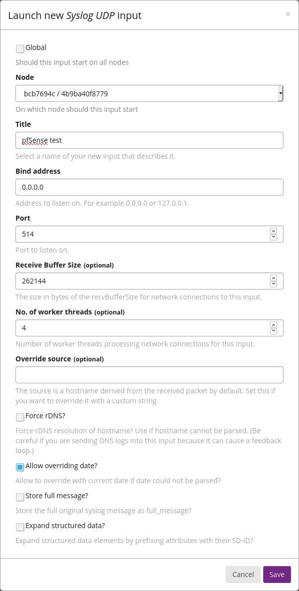

# Graylog_Extractors_pfSense

## Overview
Graylog extractors for the following pfSense services:
* Firewall
* Suricata

## Explanation
### pfSense firewall logs
#### pfSense versions up to 2.5.0
In pfSense versions up to 2.5.0, pfSense used logs in the RFC 3164 format. The format of the actual log message is [broken down as follows](https://docs.netgate.com/pfsense/en/latest/monitoring/logs/raw-filter-format.html) (hostname is not included in syslog data sent to remote log hosts):  
```<Timestamp> <Hostname> filterlog: <CSV data>```  

The CSV data consists of the following:
* Common fields (this is in all messages)
* Then IPv4 or IPv6 specific data
* Then IP data
* Then protocol-specific data (e.g., TCP, UDP, or ICMP)

This gives a total of 13 combinations (below). My are extractors for everything but CARP/VRRP.
* IPv4 TCP
* IPv4 UDP
* IPv6 TCP
* IPv6 UDP
* Eight different responses for ICMP
  * ICMP Echo
  * ICMP Unreachable protocol
  * ICMP Unreachable port
  * ICMP Uncreachable other
  * ICMP Need Frag
  * ICMP TStamp
  * ICMP TStamp Reply
  * ICMP Default
* ~~CARP/VRRP~~

#### pfSense versions 2.5.0 and up
In pfSense versions 2.5.0 and up, pfSense [offers the options](https://docs.netgate.com/pfsense/en/latest/monitoring/logs/settings.html) of either RFC 3164 (legacy) or RFC 5424 (modern).
  - RFC 3164: Netgate's RFC 3164 format slightly changed from 2.4.5-p1, so new extractors were needed. They included the PID of the filterlog process in the log, where they didn't before.
  - RFC 5424: I have not tested this yet, so I do not have extractors for it.

## pfSense configuration
Go to *Status*-->*System Logs*-->*Settings*-->*General Logging Options*.
* Select your log type (RFC 3164 or RFC 5424)
* I enable (check the box) on the following options:
  * *Log packets matched from the default block rules in the ruleset*
  * *Log packets matched from the default pass rules put in the ruleset*
  * *Log packets blocked by 'Block Bogon Networks' rules*
  * *Log packets blocked by 'Block Private Networks' rules*
  * *Log errors from the web server process*
  * *Disable writing log files to the local disk*

On the same page, scroll down to *Remote Logging Options*.
* Enable (check the box) next to *Send log messages to remote syslog server*
* Input the Graylog server name and port in the box (you can send logs to up to three remote log servers)
* Select your event types (I typically enable *System Events*, *Firewall Events*, *DHCP Events*, and *Network Time Protocol Events*)

Click *Save* at the bottom of the page when you are done.

### pfSense Suricata logs
I'm assuming you have Suricata installed, your lists configured, and interfaces setup. If so, go to *Services*-->*Suricata*, and then click *Edit* on your interface.
* Enable (check the box) next to *Send Alerts to System Log*
* Configure *Log Facility* and *Log Priority* (I left mine at the default)

Click *Save* at the bottom of the page when you are done.

## Graylog configuration
Go to *System/Inputs*-->*Inputs*. From the dropdown, select an input of type *Syslog UDP* and click *Launch new input*. From the *Node* dropdown, select your node. Under *Port*, set the port you specified in pfSense (e.g., 514). Click *Save* at the bottom of the page when you are done.  


Then, click *Manage extractors*, then click *Actions*, then *Import extractors*.  


Copy/paste the raw JSON file(s) below into the box and click *Add extractors to input*. Repeat for each file you want to import.  

**pfSense versions up to and including 2.4.5-p1 (RFC 3164)**
 - [Firewall](https://raw.githubusercontent.com/loganmarchione/Graylog_Extractors_pfSense/master/RFC_3164/pfSense_Extractors_Firewall.json)  
 - [Suricata](https://raw.githubusercontent.com/loganmarchione/Graylog_Extractors_pfSense/master/RFC_3164/pfSense_Extractors_Suricata.json)  

**pfSense version 2.5.0 (RFC 3164 - Netgate slightly changed the format)**
  - [Firewall](https://raw.githubusercontent.com/loganmarchione/Graylog_Extractors_pfSense/master/RFC_3164/pfSense_Extractors_Firewall_2.5.0.json)
  - Suricata - I have not tested the old file, so I can't guarantee it will work on pfSense 2.5.0.

**pfSense version 2.5.0 (RFC 5424)**
  - Firewall - Coming soon
  - Suricata - Coming soon
